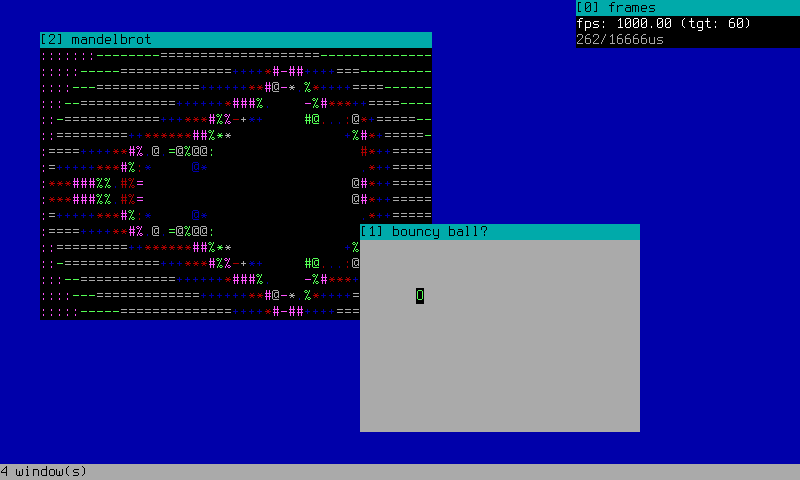
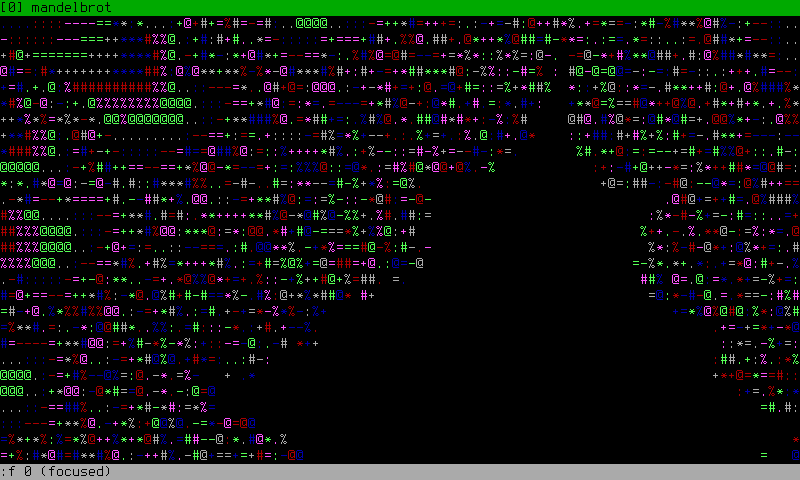
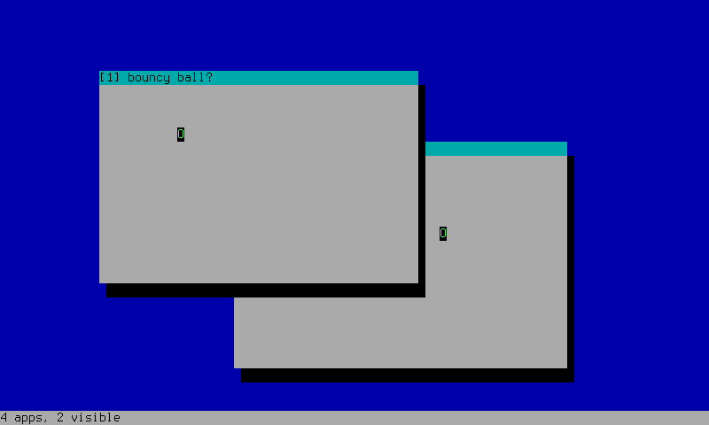

# ttydesktop
a desktop environment window manager-like thing that runs in the terminal

## features
* dynamic app loading with libdl
* opening, closing, moving, resizing, focusing windows (a shocker)
* windows also have events
* still STILL half-baked multithreading
* a bar at the bottom which is a status bar but also isnt a status bar
* i hate ncurses
* automatic application loading on startup from config files (autostart basically)
* hookman: a meta-app that lets other apps hook into almost anything (window draws, events, status bar, etc.)
* hookman also has function exports so one app can call functions of other app
* status bar oh wiat i already said that

## building
prerequisites:
* by default clang+lld, can change in makefile
* pthreads
* libdl

then, to build everything: `make` (or `make all`)

resulting binaries and .so's (apps) go in `bin/`

## usage
run with `./bin/ttydesktop [app1.so] [app2.so] ...`

### usage 2
this is kinda a state machine

* normal - state on launch and when youre not focused or typing a command
* * `q` - quit
* * `o` - open a new window, prompts for path to .so
* * `f` - focus a window by index
* * `m` - move a window by index with arrow keys or hjkl
* * `r` - resize a window by index also with arrow keys or hjkl
* * `c` - close a window by index
* command - state when typing a command
* * `enter` to submit, `esc` to cancel
* * `left`/`right` arrows to move cursor within the buffer
* * `backspace` to delete characters at cursor
* focused - when a window is focused
* * all key events are sent to the focused window
* * except `esc`, that one unfocuses

## autostart
you can specify apps to load automatically by creating an `autostart.conf` file. it looks in these places (in this order):
1. `~/.config/ttydesktop/autostart.conf`
2. `/etc/ttydesktop/autostart.conf`
3. `./autostart.conf`

one path to an `.so` per line, `#` for comments.

## app search paths
if an app path doesn't start with `/` or `.`, ttydesktop looks for it in these directories:
1. `./bin/`
2. `$TTYDESKTOP_PATH` (environment variable)
3. `~/.local/lib/ttydesktop/`
4. `/usr/local/lib/ttydesktop/`
5. `/usr/lib/ttydesktop/`

## included apps
* `bin/bouncy.so`: a bouncing ball/circle/O thing
* `bin/clock.so`: draws a digital clock in the status bar (bottom right); needs `hookman.so`
* `bin/example.so`: a baseline for making new apps
* `bin/frames.so`: frame timing controller and info (fps, timings). use `+`/`-` or `q`/`e` to change target FPS (+/- 5 or +/- 1 respectively); needs `hookman.so`
* `bin/hookman.so`: the core hooking engine. load first if you want other cool stuff to work
* `bin/mandelbrot.so`: interactive mandelbrot renderer
    
* `bin/shadows.so`: adds simple drop shadows to windows; needs `hookman.so`
    

## hookman
hook points for windows, desktop updates, status bar, and other stuff; supports `before`, `after`, and override hooks

also has `export`, `unexport`, and `call` for cross-app function calling

## license
GPLv3
